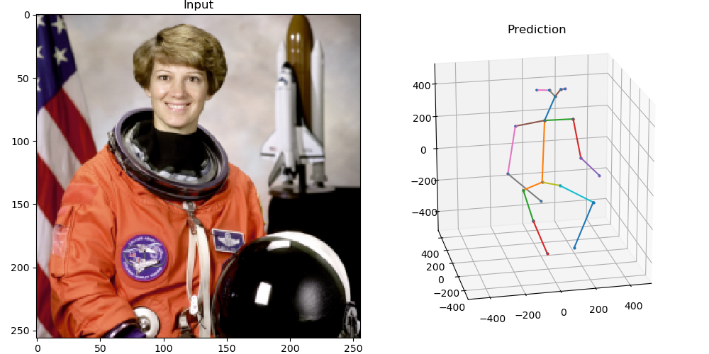

# MeTRo 3D Human Pose Estimator



### What is this?
Code to train and evaluate the MeTRo method, proposed in our paper:
* István Sárándi, Timm Linder, Kai O. Arras, Bastian Leibe: [*"Metric-Scale Truncation-Robust Heatmaps for 3D Human Pose Estimation"*](https://arxiv.org/abs/2003.02953), IEEE Int. Conf. on Automatic Face and Gesture Recognition 2020.

### What does it do?
It takes a single **RGB image of a person as input** and returns the **3D coordinates of pre-defined body joints** relative to the pelvis. The coordinates are estimated in millimeters directly. Also, it always returns a complete pose by guessing joint positions even outside of the image boundaries (truncation).  
 
### How do I run it?
There is a small, self-contained script called `inference.py` with minimal dependencies (just TensorFlow + NumPy), which can be used for inference with a pretrained, exported model.
This makes it easy to drop it into different application scenarios without carrying along the whole training codebase. The following exported models are available now:

| 3D Training Data | 2D Training Data | Architecture | Joint Convention | Model Download |
| ---- | ---- | ---- | ---- | ---
| H36M | MPII | ResNet-50 | H36M (17) | [stride_32](https://omnomnom.vision.rwth-aachen.de/data/metro-pose3d/h36m_st32.pb), [stride_16](https://omnomnom.vision.rwth-aachen.de/data/metro-pose3d/h36m_st16.pb), [stride_8](https://omnomnom.vision.rwth-aachen.de/data/metro-pose3d/h36m_st8.pb), [stride_4](https://omnomnom.vision.rwth-aachen.de/data/metro-pose3d/h36m_st4.pb)
| H36M, 3DHP, 3DPW, CMU-Panoptic | COCO, MPII | ResNet-50 | COCO/CMU (19) | [stride_32](https://omnomnom.vision.rwth-aachen.de/data/metro-pose3d/many_rn50_st32.pb), [stride_16](https://omnomnom.vision.rwth-aachen.de/data/metro-pose3d/many_rn50_st16.pb), [stride_8](https://omnomnom.vision.rwth-aachen.de/data/metro-pose3d/many_rn50_st8.pb), [stride_4](https://omnomnom.vision.rwth-aachen.de/data/metro-pose3d/many_rn50_st4.pb)
| H36M, 3DHP, 3DPW, CMU-Panoptic | COCO, MPII | ResNet-101 | COCO/CMU (19) | [stride_32](https://omnomnom.vision.rwth-aachen.de/data/metro-pose3d/many_rn101_st32.pb), [stride_16](https://omnomnom.vision.rwth-aachen.de/data/metro-pose3d/many_rn101_st16.pb), [stride_8](https://omnomnom.vision.rwth-aachen.de/data/metro-pose3d/many_rn101_st8.pb), [stride_4](https://omnomnom.vision.rwth-aachen.de/data/metro-pose3d/many_rn101_st4.pb)

Use the inference script as follows:

```bash
model=many_rn101_st16.pb
wget https://omnomnom.vision.rwth-aachen.de/data/metro-pose3d/$model
./inference.py --model-path=$model
```

These `.pb` files contain both the full TensorFlow graph and the weights.

The main purpose of the H36M model is to get benchmark results comparable with prior work.
If you simply need good 3D pose predictions for a downstream application, it's recommended to use the model trained on more data.
These were also trained with upper body crops, to enhance truncation robustness.
Furthermore, they use the COCO/CMU-Panoptic joint convention, so some facial keypoints are also estimated (eyes, ears, nose).


### How do I train it?
1. See [DEPENDENCIES.md](docs/DEPENDENCIES.md) for installing the dependencies.
2. Then follow [DATASETS.md](docs/DATASETS.md) to download and prepare the training and test data.
3. Finally, see [TRAINING.md](docs/TRAINING.md) for instructions on running experiments.

### How do I cite it?
If you use this work, please cite it as:

```bibtex
@inproceedings{Sarandi20FG,
  title={Metric-Scale Truncation-Robust Heatmaps for 3{D} Human Pose Estimation},
  author={S\'ar\'andi, Istv\'an and Linder, Timm and Arras, Kai O. and Leibe, Bastian},
  booktitle={Automatic Face and Gesture Recognition, 2020 IEEE Int. Conf. on},
  year={2020},
  note={in press}
}
```
